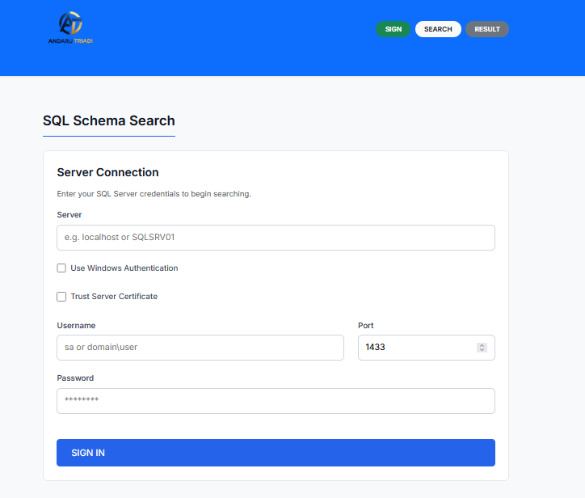
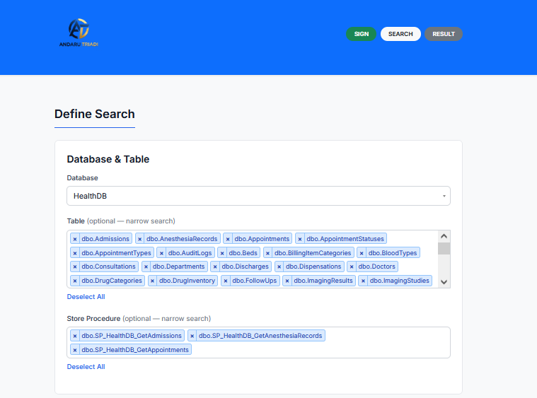
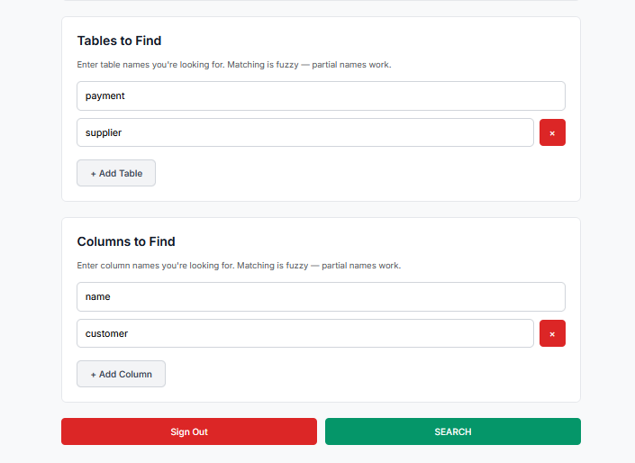
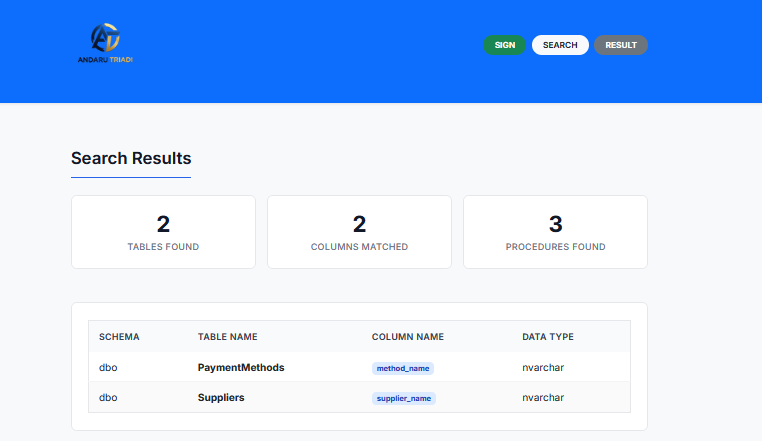
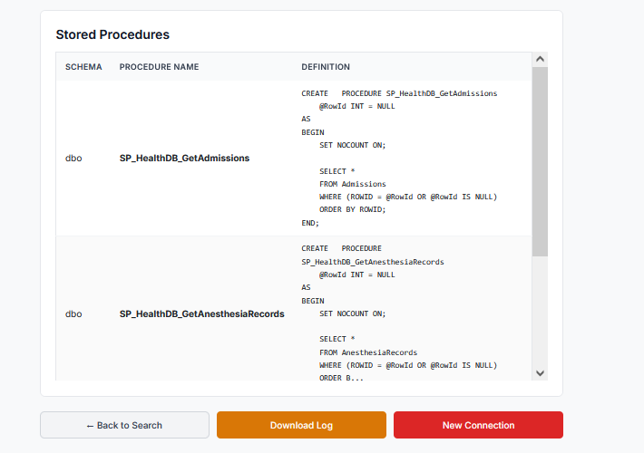
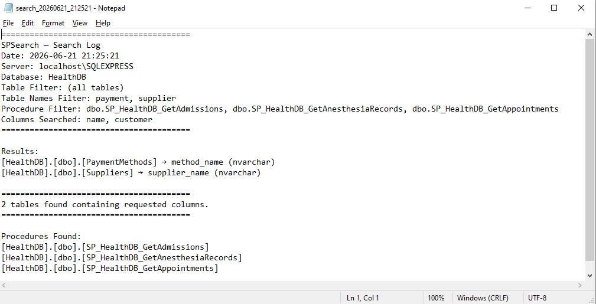

# SPSearch — Agent Tracking

## Project Overview

SQL Server schema search tool. Find which tables have the columns you need without using SQL Profiler. Minimalist UI, .NET 10 backend.

## Database Scripts

- **`sql/health_database.sql`** — Original schema (Patients, Doctors, Departments)
- **`sql/health_database_50_tables.sql`** — Full 50-table schema with ROWID PKs, dex_row_id, FK relationships, 3 sample records each
- **`sql/shopping_database_100_tables.sql`** — 134-table e-commerce schema (ShoppingDB), ROWID PKs, dex_row_id, 169 FK constraints, 3 records each (DEX001–DEX402)
- **`sql/ticketing_database_gp_style.sql`** — 25-table ticketing schema (Microsoft Dynamics GP naming: XXnnnss), ROWID PKs, dex_row_id, 38 FK constraints, 3 records each (DEX001–DEX075)
- **`sql/TABLE/`** — Individual CREATE TABLE scripts: `HealthDB.sql` (50 tables), `ShoppingDB.sql` (134 tables), `TicketingDB.sql` (25 tables)
- **`sql/SP/`** — 209 SELECT-only stored procedures (one per table), naming: `SP_{Database}_Get{TableName}.sql`

## Tech Stack

- **Backend**: .NET 10, ASP.NET Core Web API, Microsoft.Data.SqlClient
- **Frontend**: jQuery 3.7, Bootstrap 5.3, Select2 4.1, vanilla CSS (Minimalist)
- **Architecture**: Monolith (standalone ASP.NET serves static client files)

## Decisions Log

| Date | Decision | Rationale |
|------|----------|-----------|
| 2026-06-20 | Single database dropdown (not checklist) | User clarity — focus search |
| 2026-06-20 | Per-database table filter | Narrow search within a DB |
| 2026-06-20 | Log saved to server folder | Persistent history |
| 2026-06-20 | LIKE %search% matching | Column names often differ from user expectations |
| 2026-06-20 | OR logic across columns | Return any table matching at least one column |
| 2026-06-20 | Credentials sent per API call | No session management needed, stateless |
| 2026-06-20 | Standalone ASP.NET | Single deploy target, no CORS headaches |
| 2026-06-20 | Minimalist design (was NEO-Brutalism) | Cleaner UX, better readability, faster rendering |
| 2026-06-20 | Windows Auth + SQL Auth toggle | Support both trusted connection and SQL login |
| 2026-06-20 | Trust Server Certificate toggle | User opt-in for self-signed certs (local/dev servers) |
| 2026-06-21 | ROWID PK + dex_row_id convention | Consistent primary key pattern across all tables |
| 2026-06-21 | 50-table health DB seed script | Sample data for development and testing |
| 2026-06-21 | 134-table e-commerce seed script | Realistic shopping schema with payments, analytics, and marketing |
| 2026-06-21 | 25-table ticketing DB (GP naming) | Dynamics GP style XXnnnss naming convention for seed data |
| 2026-06-21 | Select2 multi-select for tables | Searchable, scrollable multi-select replaces single-dropdown — choose multiple tables or leave empty for all |
| 2026-06-21 | Select2 for database dropdown | Searchable dropdown for databases with many entries |
| 2026-06-21 | `tables` param as array (was `table` string) | Frontend sends `tables: string[]` for multi-table support |
| 2026-06-21 | State restoration on back navigation | Page 3 "Back to Search" preserves database, table selections, and column inputs via sessionStorage |
| 2026-06-21 | Select All / Deselect All for tables | Toggle link to quickly select or clear all table options |
| 2026-06-21 | File renames: index→sign, page2→search, page3→result | Cleaner endpoint naming — sign.html, search.html, result.html |
| 2026-06-21 | Clean URL routes /home /search /result | Server-side fallback routes mapped to the renamed HTML files |
| 2026-06-21 | Sign Out button on search page | Clears session and navigates to /home for fresh credential entry |
| 2026-06-21 | No auto-redirect on sign page | Removed creds redirect — sign page always shows the form (pre-filled if session exists) |
| 2026-06-21 | Select2 multi-select max-height 120px scroll | Prevents tag overflow when many tables selected |
| 2026-06-21 | Step indicator → Bootstrap badges with 10px radius | Replaced custom circles with Bootstrap `.badge bg-primary/success/secondary` |
| 2026-06-21 | Scrollable results table with sticky header | `.table-wrapper` max-height + sticky thead keeps header visible while rows scroll |
| 2026-06-21 | 209 SELECT-only SPs in sql/SP/ | One per table, naming `SP_{Database}_Get{Table}`, generated from TABLE scripts |
| 2026-06-21 | Row click → schema modal on result page | Click a result row to view full column list + TOP 3 sample records in a Bootstrap modal |
| 2026-06-21 | Tables to Find fuzzy card | Dynamic text inputs for table name patterns (LIKE %), OR between patterns, AND with column filter and multi-select |
| 2026-06-21 | Stored Procedure multi-select dropdown | Select2 multi-select listing all SPs per database, independent search alongside tables, shows SP name + truncated definition (200 chars) |
| 2026-06-21 | Account suggestion dropdown on sign page | Saved accounts in localStorage, dedup by server+username, click to auto-fill all fields |
| 2026-06-22 | Namefile SP + Parameter SP fuzzy cards | Two new cards below Columns to Find — search SPs by name pattern (LIKE %) and parameter name pattern (LIKE %), same dynamic-input UX as Columns to Find, AND logic with procedure dropdown |

## API Endpoints

| Method | Route | Purpose |
|--------|-------|---------|
| POST | /api/search/connect | Validate SQL connection |
| POST | /api/search/databases | List databases |
| POST | /api/search/tables | List tables per database |
| POST | /api/search/procedures | List stored procedures per database |
| POST | /api/search/execute | Search columns + table name patterns + stored procedures (LIKE OR) |
| POST | /api/search/schema | Get table schema + sample records |
| GET | /api/search/log/{filename} | Download log file |

## Security Rules

- Only INFORMATION_SCHEMA and sys. views — no direct table access
- All user input parameterized
- Connection string built server-side per request, never persisted
- No CREATE, UPDATE, DELETE — enforced in code

## Screenshots

| | |
|---|---|
|  | **Sign In** — Enter server credentials with Windows Auth / SQL Auth toggle, account suggestions from localStorage, and optional Trust Server Certificate setting |
|  | **Define Search** — Pick a database, select tables and stored procedures via Select2 multi-select, then configure search filters |
|  | **Filters** — Add table name patterns (OR logic) and column name patterns (LIKE %) to pinpoint results |
|  | **Table Results** — Scrollable card list of matching tables with highlighted columns; click any row for a schema modal with sample data |
|  | **Procedure Results** — Matching stored procedures showing name and truncated definition body |
|  | **Download Log** — Full search history available as downloadable server-side log files |

## Pages

1. **sign.html** (`/home`) — Server credentials form → SIGN
2. **search.html** (`/search`) — Database/table select (Select2 multi-select) + dynamic table name inputs + dynamic column inputs + dynamic SP name inputs + dynamic SP param inputs + stored procedure Select2 multi-select → SEARCH
3. **result.html** (`/result`) — Results table + stored procedure results table (scrollable, sticky header, click row for schema modal) + log download + back to search (state preserved)
